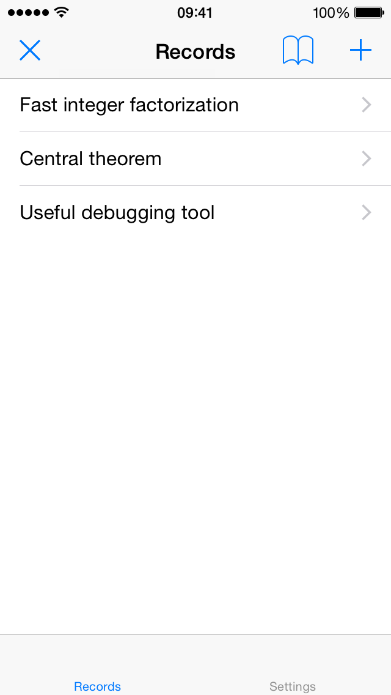
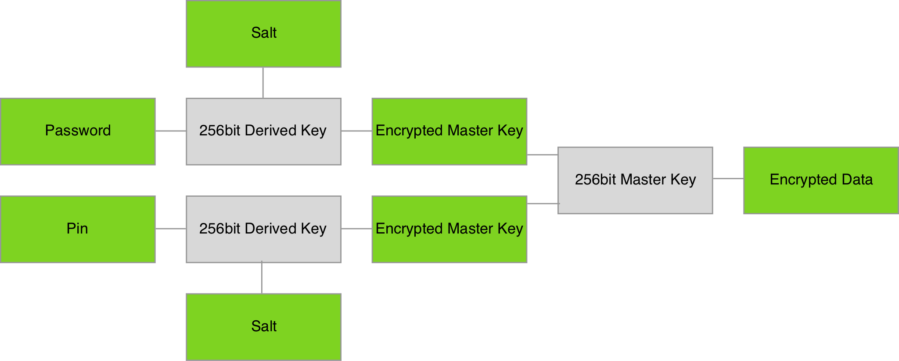
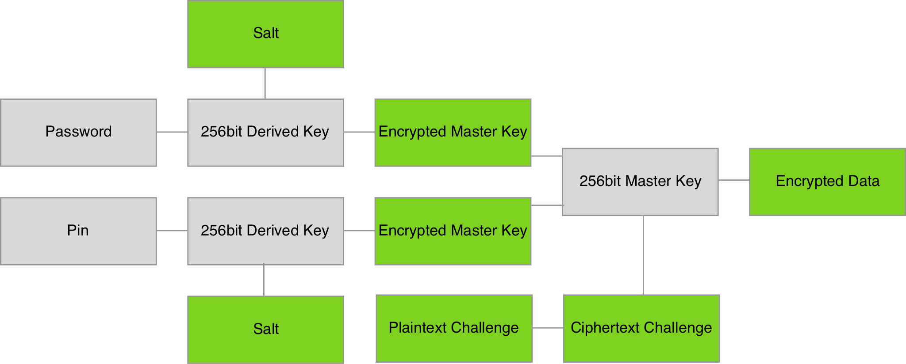
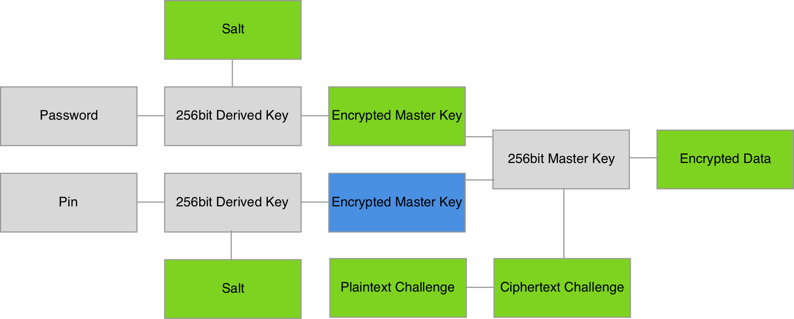

# Protecting sensitive data against offline attacks

### Jiri Dutkevic 
###### [jd@avast.com](mailto:jd@avast.com)

---

# Agenda

- focus
- why
- how
- what
- content
- summary

---

# 3 defining aspects of apps

---

---

# *\#1* what they look like

---

---

# *\#2* what they seem to be doing
#### (as perceived through the UI)

---

# *\#3* what they are **actually** doing

---

# learning from mistakes

---

# inspired by apps available on the AppStore

---

# *3* key ideas
## + a few additional side notes

---

### ACME Corporation
# Snippets
###### Bob, Alice

^ https://en.wikipedia.org/wiki/File:Box_of_%22ACME_EXPLOSIVE_TENNIS_BALLS%22_%28screencap%29.jpg

---

## Part 1
# Apparent Security

---

# Bob

---

## Demo 1
# App Walkthrough & Code

---

# Alice

---

# Jailbreaking
- altering iOS through exploits
- code signing, file system access, root access, Cydia

---

## Demo 2
# Retrieving data from the filesystem

---

# Objective-C Runtime
- runtime oriented language
- allows inspection and modification in runtime
- relevant to *Swift*

---

## Demo 3
# Objective-C runtime capabilities

---

# Snoop-it
<https://code.google.com/p/snoop-it/>
source: repo.nesolabs.de

- a debugging tool for analysing apps in runtime

---

## Demo 4
# Bypass the UI using Snoop-it

^
- insert first snippet

---

# house with doors but holes instead of windows

---

## Part 2
# Encryption

---

# Bob

---

# Encryption scheme
### Rijndael

---

# Alice

---

## Demo 5
# Sniffing sensitive APIs using Snoop-it

---

# we've added windows, but we are leaving the key under the doormat

---

## Part 3
# Tradeoffs

---

# Bob

---

# Updated encryption scheme
### Verifying password without storing it

---

# Alice

---

## Demo 6
# Bruteforcing the pin using a fake app

---

# we've added an emergency exit with a poor lock

---

## Part 4
# Summary

---

# Bob

---

# Updated encryption scheme
### Password required for initial unlock

---

# Alice

---

# when leaving, we block the emergency exit

---

# Summary
1. Encrypt
2. Do not store full information needed for decryption persistently
3. Beware of tradeoffs between UX and security

### [github.com/jirid/mdevtalk2](https://github.com/jirid/mdevtalk2)
